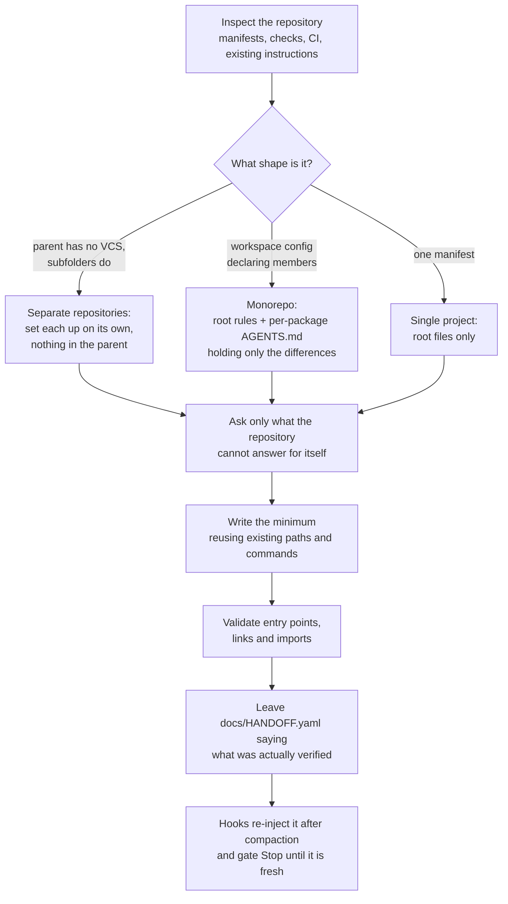

# Setup Agentic Workflow

[](https://github.com/Gmust/setup-agentic-workflow-plugin/actions/workflows/tests.yml)


A plugin that prepares a repository for coding agents — scoped instructions,
one trustworthy check command, a living handoff, optional CI — and then keeps
that handoff in the agent's context across long sessions. Four skills plus
three hooks. Single-project repositories and monorepos.

It sets up the workflow. It does not implement product features, scaffold a
stack you have not chosen, or weaken your existing checks to make setup pass.


## What it creates

| Artifact | Where | Purpose |
| --- | --- | --- |
| Agent entry points | `AGENTS.md`, `CLAUDE.md` (or `.claude/CLAUDE.md`) | Shared rules once, imported rather than duplicated |
| Per-project instructions | `<project>/AGENTS.md` | In a monorepo, only what differs from the root |
| Code and document map | inside `AGENTS.md` | Real entry points, ownership boundaries, which check covers what |
| Handoff | `docs/HANDOFF.yaml` | Living snapshot: goal, done, wip, blocked, next, decisions — ~40 lines, refs not content |
| Quality gate | your repository's own runner | One command that terminates and fails loudly |
| CI | your existing provider | Calls the same command, on the platforms you claim to support |

Existing files are merged, never replaced wholesale. A second run on an
already-configured repository makes no changes.

## Skills

| Skill | Does | Standalone trigger |
| --- | --- | --- |
| `setup-agentic-workflow` | Inspects once, asks once, runs the three parts in order, validates | "prepare this repo for agents" |
| `agent-entrypoints` | `AGENTS.md`, `CLAUDE.md` (+`@AGENTS.md`), monorepo per-project files, code map incl. design source of truth | "add AGENTS.md", "de-duplicate CLAUDE.md" |
| `quality-gate` | One check command; CI on it. Never narrows an existing script | "set up checks", "add CI for agents" |
| `handoff` | `/handoff [note]` refreshes `docs/HANDOFF.yaml`; first run adds the rule and optional hooks | "save progress", "snapshot state" |

Each skill injects the repository's current state when it loads (`!`cmd``), so
inspection costs no tool calls, and pre-approves its bundled scripts.

## Context persistence

Long sessions lose context on compaction; `docs/HANDOFF.yaml` is what survives.
Three hooks, all no-op unless that file exists:

| Hook | When | Does |
| --- | --- | --- |
| `handoff-inject.sh` | SessionStart (startup, resume, compact, clear) | Puts the handoff plus `git log -5` / `git status --short` back into context; flags lint problems |
| `handoff-counter.sh` | PostToolUse | Every `HANDOFF_EVERY` (default 15) mutating calls — Edit/Write, or Bash that looks like a write — reminds the agent to refresh, with current git facts |
| `handoff-stop.sh` | Stop | Refuses to end the turn while files changed this session are newer than the handoff, or `next` is empty, or the file exceeds 40 lines. Once per turn |

`HANDOFF_FILE` overrides the path (repo-relative). Remove the Stop entry from
`plugin.json` if the gate is too strict for your workflow. Without the plugin,
`@docs/HANDOFF.yaml` in `CLAUDE.md` loads the snapshot at session start (re-read
after compaction not guaranteed); Codex gets the rule in `AGENTS.md` only.

Known gap: nothing fires right before compaction — a PreCompact hook cannot make
the model write. The counter bounds staleness; lower `HANDOFF_EVERY` for very
long sessions.

## How it works



## Install

### Claude Code — plugin

```
/plugin marketplace add Gmust/setup-agentic-workflow-plugin
/plugin install setup-agentic-workflow@gmust-plugins
```

### Claude Code — from a checkout

```sh
git clone https://github.com/Gmust/setup-agentic-workflow-plugin
claude --plugin-dir setup-agentic-workflow-plugin/plugins/setup-agentic-workflow
```

Copying single skill folders into `~/.claude/skills/` is not supported any more:
the skills reference `../../shared/` and `${CLAUDE_PLUGIN_ROOT}`, and the hooks
live in `plugin.json`.

### Codex

```sh
git clone https://github.com/Gmust/setup-agentic-workflow-plugin
mkdir -p ~/.agents/skills
cp -R setup-agentic-workflow-plugin/plugins/setup-agentic-workflow/skills/* ~/.agents/skills/
cp -R setup-agentic-workflow-plugin/plugins/setup-agentic-workflow/shared ~/.agents/shared
```

`shared/` must sit two levels up from each `SKILL.md` so `../../shared/` links
resolve. `${CLAUDE_PLUGIN_ROOT}` lines are Claude Code substitutions and will
not expand under Codex; the hooks are Claude Code only. Codex has not yet been observed loading this skill — see
[Feedback wanted](#feedback-wanted).

## Use

Ask for it in your own words — the skill activates on the request, not on its
name:

```
Prepare this repository for working with coding agents.
Add AGENTS.md and rules for agents here.
Set up checks and a handoff for agentic work.
/handoff finished the retry logic, tests green
```

It inspects the repository first, states the gaps and the files it proposes, and
asks only the questions it cannot answer from what it found.

## What it refuses to do

This is the part that distinguishes it from "generate me an AGENTS.md":

- **It will not edit your manifest** when a suitable check command already
  exists. An incomplete gate is reported and a change proposed, not applied.
- **It will not narrow an existing script.** Hooks, CI steps and pull request
  templates call scripts by name; removing a step from one weakens every caller.
- **It will not widen a hook** without asking — making `pre-push` slower changes
  everyone's workflow.
- **It will not write "tested"** about something it did not run. Checks it could
  not execute are recorded as not run, with the reason.
- **It will not scaffold a product** for an empty repository, or invent a spec,
  an architecture, or a precedence between conflicting documents.
- **It will not touch your personal setup** — no installing skills, hooks or MCP
  servers as a side effect of repository setup.
- **It changes nothing on a repeat run** when the requested setup is already
  complete, including dates and handoff text.

## Feedback wanted

Two things are unproven, and one report closes either of them:

1. **Codex activation.** Run it in a repository with no agent files, phrase the
   request in your own words, and do not name the skill. Did it activate?
2. **A real monorepo.** Several packages with genuinely different check
   commands. The monorepo branch has been exercised on a constructed fixture and
   on a two-crate workspace, not on a large one in daily use.

Useful in any report: the resulting `docs/HANDOFF.yaml` — if it claims something
was verified that never ran, that is the most serious defect this skill can
have — and whether a second run with the same answers changed anything.

Run it on a branch or on something disposable: the skill writes into the
repository. `git checkout -- . && git clean -fd` undoes everything.

## Helper scripts

Both helpers are read-only, standard-library Python, and optional — the skill
falls back to manual inspection when Python is unavailable. Neither executes any
command it discovers, and neither follows references outside the target
repository.

```sh
python3 shared/scripts/inspect_repo.py <repo-root> [--max-depth N]
python3 shared/scripts/validate_setup.py <repo-root> --agents codex claude --document docs/HANDOFF.yaml
```

`inspect_repo.py` prints a bounded inventory of manifests, entry points, checks
and CI files. It matches a fixed list of known names plus a few suffixes, so an
empty `paths` result means the ecosystem is unrecognized, not that the
repository is empty; `unclassified_root_files` surfaces the root files it could
not classify, which is where an unfamiliar stack shows up.

`validate_setup.py` exits nonzero when a required entry point is missing, a
local Markdown link points at nothing, an import escapes the repository, or
imports form a cycle. Its `verified` block reports how many documents, local
links and imports were actually checked, so a green result on a file with no
links is not mistaken for a thorough pass.

### What the validator does not do

It parses a simple Markdown subset. Fenced and indented code blocks are skipped,
so example paths are not reported. Reference-style links, complex links and
inline `@` mentions produce warnings for manual review rather than errors. It
does not validate heading anchors, prove that an agent loaded the generated
instructions, or reason about CI semantics.

## Development

```sh
python3 -B -m unittest discover -s plugins/setup-agentic-workflow/shared/tests -v
sh plugins/setup-agentic-workflow/hooks/test.sh
```

CI runs the Python suite on Ubuntu, macOS and Windows against Python 3.10 and
3.13, and the hooks self-check on Ubuntu and macOS.

The suite covers helper mechanics only. Behavioral scenarios for the skill
itself live in `shared/evaluation.md`; run them in disposable repositories,
twice with the same answers, and compare file bytes between runs. A passing unit
test is not evidence that the skill behaves correctly.

## Credits

The walking cat is a 32×32 sprite from a royalty-free pixel-art pack; its
palette is Zenit-241.

## License

MIT. See [LICENSE](LICENSE).
